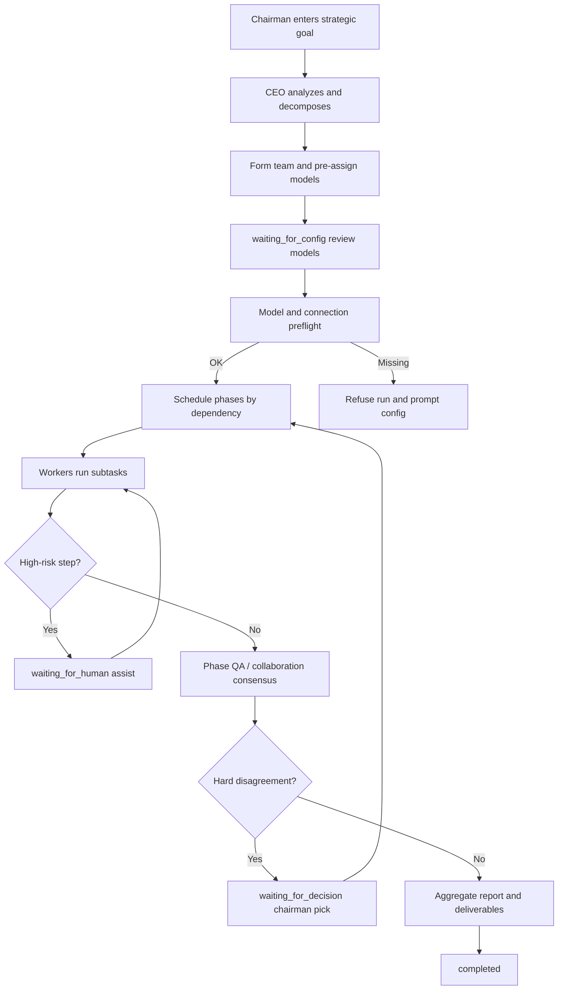

# AI Team Engine

[中文](./README.md) | **English**

A browser-based visual multi-agent orchestration engine for planning and collaborative execution.

It maps an enterprise-style hierarchy—**Chairman → CEO → specialist workers**—onto LLM agents: natural-language strategic goals are decomposed into schedulable phases, workers run in parallel where dependencies allow, and humans are brought in at critical gates (HITL).

> **Positioning**: local single-user / single-tenant preview (optional local Gateway).  
> **Out of scope by design:** public SaaS, multi-tenant isolation, or cross-tenant billing. See [Positioning & commercial boundaries](#positioning--commercial-boundaries).

---

## Core workflow



### Status reference

| Stage | `systemStatus` | Description |
|-------|----------------|-------------|
| Publish goal | `running` | Chairman submits a high-level objective |
| Decompose & staff | `running` | CEO decomposes work; creates/reuses agents |
| Review config | `waiting_for_config` | Assign models per agent, then **Start** |
| Parallel execution | `running` | Dependency groups scheduled via `Promise.all` |
| Human assist | `waiting_for_human` | Login/pay/verify-style steps intercepted fail-closed |
| Decision gate | `waiting_for_decision` | Unresolved collaboration escalates proposals |
| Pause / resume | `paused` | Hot team reorg; recoverable checkpoints after refresh |
| Terminal | `completed` / `blocked` | Success finish, or blocked (skip/fail paths) |

---

## Capabilities

### Orchestration & execution

- **Enterprise hierarchy**: Chairman (human) sets goals and key authorizations; CEO decomposes, schedules, runs QA, and reports; workers produce phase outputs.
- **LLM task decomposition**: Dynamic teams and phase dependencies; same-name roles can be reused.
- **Parallel scheduling**: Independent phases run concurrently; same assignee is serialized to avoid agent state clashes.
- **Typed results**: Subtasks/phases use statuses such as `success` / `failed` / `blocked` / `skipped`; template fallbacks, skips, and tool denials **do not count as success**.
- **Phase QA**: Automatic review at phase end; one revise round when quality is weak so empty deliverables do not enter the final report unchecked.

### Human collaboration (HITL / decisions)

- **Unified user gate**: Human assist and chairman decisions share one mutex plus a **generation token**; `stop` invalidates queued and in-flight gate writes to reduce race “resurrection”.
- **High-risk fail-closed (two-stage)**: Keyword/role hits intercept immediately; otherwise an LLM answers YES/NO. Missing model, unparsable output, or call failure all require a human. Timeouts only escalate alerts and **never auto-skip as success**. English paraphrases can still slip through.
- **Opaque credentials**: HITL input is not injected into prompts/chat verbatim by default; public confirmation copy is redacted.
- **Decision recovery**: Hot and cold resume promote checkpoints and remove the decided phase from `inFlight` so refresh does not replay it.

### Checkpoints & recoverability

- **Running checkpoint** `running_execution`: completed phases, failure list, subtask-level `inFlight`.
- **Gate checkpoints**: `waiting_for_config` / `waiting_for_human` / `waiting_for_decision` can be restored after refresh.
- **Atomic promote**: Returning from a gate to `running` merges `runningSnapshot` before write, shrinking the clear-then-write window.
- **Abort scope**: `stop` cancels in-flight LLM/SSE, wakes pause and pending promises, and avoids leaving status stuck on `waiting_for_*`.

### Tools & policy

- **Tool registry**: Built-in read-oriented tools (time, calculator, etc.); custom tools cannot override builtin names.
- **Tool policy**: High-risk / unknown custom tools denied by default. The in-app “MCP” item is a **simplified HTTP** bridge (`/tools/list`, `/tools/call`), **not** official MCP or SSE; tools stay `high_risk` until explicitly allowed.
- **Audit preview redaction**: Tool params and error text are filtered before timeline/logs.

### Privacy & observability

- **Sensitive-data redaction**: Message boundary, logs, timeline, and deliverable reports redact common secret/OTP patterns (see `src/utils/sensitiveData.js`).
- **Key storage**: Direct mode keeps full provider API keys in IndexedDB. Gateway mode keeps only the Gateway token in the browser while provider keys stay in the Gateway process environment. The `localStorage` bootstrap contains no full secret.
- **Cost / tokens**: Usage tracked per agent and model.
- **Prompt Inspector / timeline replay**: Local PoC-level debugging and process review.

### UI & deliverables

- **Ten sidebar panels**: progress, cost, replay, logs, collaboration, report, knowledge base, plugins, debug, config.
- **Export**: Markdown / HTML / PDF (via browser print).
- **Session archive**: Restore history; inject cross-session summaries into new runs.

Some features are demo scaffolding: keyword knowledge base (not vector RAG), role plugin templates, a simplified HTTP tool bridge, and local workspace structs. The repo includes an **optional local single-tenant Gateway**, but no durable server-side agent runner or release-grade control plane—see [DEPLOYMENT.md](./DEPLOYMENT.md).

---

## Tech stack

| Layer | Choice |
|-------|--------|
| UI | React 19 + Vite 7 |
| State | Zustand (dual store: localStorage bootstrap + IndexedDB full) |
| Styling | Vanilla CSS variables (no external UI kit) |
| Orchestration core | `src/engine/ceoAgent.js` and neighbors |
| Safety-related | CSP (`index.html`), DOMPurify, `sensitiveData`, tool policy |
| Backend | Direct by default; optional local single-tenant Gateway for provider keys and run records |

### Engine modules (sketch)

```
src/engine/
  ceoAgent.js           # lifecycle, scheduling, HITL/decision gates
  executionControl.js   # mutex, pause barrier, abort semantics
  workflowCheckpoint.js # running/gate checkpoints and inFlight
  executionResult.js    # typed step status
  llmClient.js          # multi-provider requests, Abort/SSE cancel
  toolPolicy.js         # tool risk and allow rules
  capabilityRuntime.js  # tool execution and audit
  taskDecomposer.js     # goal decomposition
  modelConfig.js        # providers and secrets (IndexedDB)
  timelineRecorder.js   # timeline (redacted)
src/utils/sensitiveData.js
src/store/store.js + storeRecovery.js
```

---

## Quick start

### Requirements

- Node.js **18+** (20+ recommended)
- npm

### Install & run

```bash
git clone https://github.com/hudijiang/ai-team-engine.git
cd ai-team-engine
npm install
npm run dev
```

Open the URL printed by the terminal (often `http://localhost:5173`).

### Test & build

```bash
npm test          # Node built-in test runner regressions
npm run check     # test + production build
npm run build     # tsc && vite build
npm run gateway   # local single-tenant Gateway
npm run dev:all   # Vite + Gateway together
```

CI can run `npm run check` on push/PR.

---

## How to use

1. **Configure models**  
   - Direct mode: set a provider endpoint and API key, then fetch models.
   - Gateway mode: start `npm run gateway`, enter its URL/token under **⚙️ Config**, then fetch models from the server or manually add a model ID inside an explicit provider group. No provider key is stored in the browser.
   - Explicitly select a CEO model before publishing a goal, then review worker models after team creation.

2. **Publish a goal**  
   Example: `Plan a local lifestyle mini-program` → **Publish** → review team & models → **Start execution**.

3. **Human assist (HITL)**  
   Login/payment-style steps pause the run. Confirm after finishing the step externally, or skip explicitly (recorded as **skipped**, not success). **Do not** paste real OTPs or production secrets into chat.

4. **Decision disagreements**  
   When collaboration fails to converge, pick a proposal or enter a custom decision to continue.

5. **Stop / pause / refresh**  
   - **Stop**: cancel LLM work, bump gate generation, clear pending callbacks.  
   - **Pause**: reorganize the team, then resume.  
   - **Refresh**: recoverable checkpoints follow the safe recovery path (`storeRecovery`).

6. **Sessions**  
   Load history; new sessions may carry prior goals and key output summaries.

---

## Positioning & commercial boundaries

Scope now and later is **single-tenant**: one machine for one operator.  
**Will not build:** public SaaS, multi-tenant isolation, or cross-tenant billing.

| Suitable for | Out of scope / not built |
|--------------|--------------------------|
| Local demos, internal single-tenant trials | Public SaaS / multi-tenant |
| BYOK or a local Gateway holding keys | Agents continuing after the tab closes (not built) |
| Orchestration + HITL validation | Commercial SLA / compliance certification |

**Known limits:**

- An optional local single-tenant Gateway exists, but there is no server-side job queue; execution lives in the browser tab lifecycle.
- In **direct mode**, the browser sends vendor keys and prompts to the configured URL. In **Gateway mode**, it sends a Gateway token, model ID, and prompt to the local Gateway; vendor keys remain in its environment. The proxy uses an exact provider registry, host allowlist, and private-host denial.
- Redaction is best-effort and cannot guarantee 100% coverage of every language or format.
- Default tools are read-oriented builtins; real web search, code sandboxes, and standard MCP need extra integration.
- No server-side delete/export compliance workflow.

**If this single-tenant preview should get more reliable, prioritize:** a keyless Gateway happy path, run-record reconciliation, local network bounds, and main-path regressions. Not billing.

More: [PRIVACY.md](./PRIVACY.md) · [DEPLOYMENT.md](./DEPLOYMENT.md)

---

## Roadmap (directional)

Work in parallel; do not wait to finish a 3.8k-line CEO split before any Gateway:

1. **Incremental split**: gates live in `src/engine/gateController.js`; next is the phase runner
2. **Minimal single-tenant Gateway**: with Gateway on, the browser can run without vendor keys (model IDs + token). Run records sync with revision. Closing the tab still stops live agents
3. Playwright on the main path / optional real-provider smoke tests
4. Later (still single-tenant): tool sandboxes and a visual editor. No SaaS.

---

## License

[MIT License](./LICENSE) — provided as an open-source PoC / tech preview, **without commercial SLA or security certification claims**.
