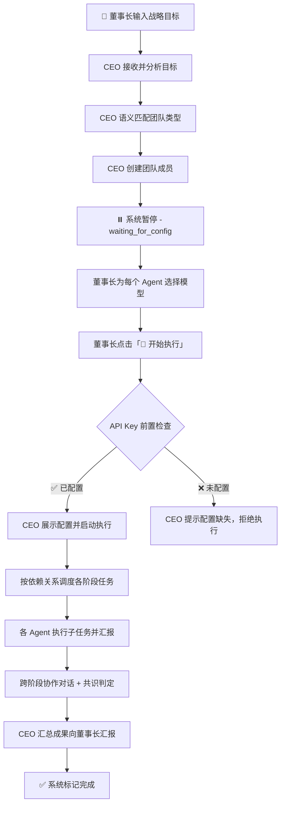

# AI Team Engine - 多Agent协调系统

一个基于现代浏览器环境的可视化多智能体（Multi-Agent）任务编排与协同执行平台。

本项目将现代企业治理结构（董事长-CEO-专业域员工）抽象为 Agent 间的层级协作关系，将复杂的宏观商业目标通过自然语义拆解，实现真正的自动化系统流转。

## 🌟 核心流程流转



### 流程说明

| 阶段 | 状态 | 负责方 | 说明 |
|-----|------|-------|------|
| 1. 发布目标 | `running` | 董事长 | 输入框输入目标并点击"发布" |
| 2. 分析目标 | CEO:`planning` | CEO | 语义分析目标关键词，智配匹配场景团队 |
| 3. 组建团队 | CEO:`executing` | CEO | 动态创建团队成员，自动预分配合适的 AI 模型（复用已有同名 Agent） |
| **4. 等待配置** | **`waiting_for_config`** | **董事长** | **⏸ CEO 暂停执行，等待董事长核对配置模型** |
| 5. API Key 检查 | `running` | CEO | 验证所有 Agent 的 Provider 是否已配置 API Key/URL |
| 6. 确认执行 | `running` | 董事长 | 点击"🚀 开始执行"，CEO 恢复工作流 |
| 7. 任务执行 | 各 Agent:`executing` | 全体 | 按依赖关系组别并发执行各细分阶段 |
| **8. 人工介入** | **`waiting_for_human`** | **董事长** | **🚨 遇"扫码、支付、验证"等敏感操作，CEO 将主动拦截** |
| 9. 成果汇报 | CEO:`reviewing` | CEO | 收集各 Agent 成果，附带详细成果产出报告 |
| 10. 完成项目 | `completed` | 系统 | 标记完成，可重置或恢复历史会话 |

## ✨ 核心特性

- 🏢 **企业化层级架构**
  - **董事长 (Human)**：只负责发布宏观目标（如："开发一个电商小程序"或"在抖音上起号赚钱"），并在关键节点提供人工授权。
  - **CEO (Orchestrator)**：接收目标，基于语义分析智能匹配所需专业团队，调度任务执行与依赖控制。
  - **专业员工 (Worker)**：分阶段完成细分任务，能力互补透明协作。

- 🧠 **智能团队匹配与模型分发**
  - 内置 7 大行业高频场景的语义拆解引擎。
  - 支持多达 10 家国内外主流大模型 API 接入。
  - CEO 根据员工的专业职能，自动为其智能派发最合适的大语言模型。
  - **Agent 复用**：同名角色自动复用，避免重复创建。

- 🔄 **会话管理与上下文连续性**
  - 会话归档与恢复：历史会话可一键加载，恢复 Agent 状态和产出。
  - **跨会话上下文注入**：新会话自动携带前次会话的目标和关键产出摘要，Agent 理解连续对话。
  - 文件日志系统：按会话分文件存储，便于排查问题。

- ⏸️ **安全感拉满的 HITL (Human-in-the-loop) 机制**
  - 执行沙盘全程可见；
  - 内置操作风险嗅探器，敏感操作时自动暂停，等待董事长安全接管。

- 🛡️ **API Key 前置检查**
  - 点击"开始执行"时自动验证所有 Agent 的 Provider 配置。
  - 未配置时 CEO 明确提示缺少哪些配置，拒绝执行避免浪费时间。

- 🎨 **极致纯粹的工程设计**
  - 无依赖地构建复杂的弹性响应式管理界面（不依赖外部 UI 框架）。
  - 基于 Zustand 的细粒度状态管理。
  - 对话流详情默认展开，CEO 汇报附带完整成果报告。

## 🛠 技术栈

- **框架**：React 18 (Vite 环境)
- **状态管理**：Zustand
- **样式**：原生 Vanilla CSS3 + Variables
- **日志**：前端 Logger + Vite 插件写文件
- **其他层**：纯前端逻辑，无独立后端依赖，跨源请求直连大模型 API

## 🚀 快速启动

### 前置要求
- Node.js (建议 v18+)
- 包管理器 (npm / yarn)

### 安装与运行

```bash
# 1. 克隆代码
git clone https://github.com/hudijiang/ai-team-engine.git
cd ai-team-engine

# 2. 安装依赖
npm install

# 3. 启动开发服务器
npm run dev
```

打开浏览器访问终端输出的本地地址（默认通常是 `http://localhost:5173`）。

## ⚙️ 模型配置与使用手册

1. **设置 API Key**：
   - 启动应用后，点击右侧侧边栏的 **"⚙️ 配置"** 标签。
   - 系统内置了对 OpenAI, Anthropic, Google, DeepSeek, 智谱等模型的请求适配。
   - 输入您持有的任意厂商 API Endpoint 和 API Key（数据仅存储在浏览器 localStorage 中）。

2. **下发任务**：
   - 在左上角输入想要测试的宏观目标，例如："计划开发一款本地生活微信小程序"。
   - 点击**发布**，观察系统自动分工和实时通信。

3. **会话管理**：
   - 对话面板顶部显示历史会话卡片，点击 🔄 按钮可恢复任意历史会话。
   - 新会话自动继承前次会话的上下文，Agent 能理解连续提问。

4. **人工接管 (HITL 测试)**：
   - 输入涉及账号强安全的目标，如："帮我在小红书注册个账号发文"。
   - 当任务流执行到相关节点时，系统会自动暂停，您可在弹出的红框内模拟输入验证码放行。

## 📖 TODO & 未来的演进计划

### 🔥 近期（核心体验增强）

- [x] **执行中断与热重组**：支持董事长在运行中强制中断当前执行，动态增删团队成员或重新分配职能，无需重置整个流程。
- [x] **交付物多格式导出**：支持将交付报告导出为 PDF / Markdown / Word 文件，便于线下传阅和归档。
- [x] **Agent 记忆与学习**：为每个 Agent 引入持久化记忆模块，跨会话保留专业领域经验，后续任务自动参考历史产出提升质量。
- [x] **任务执行回放**：将完整的执行过程（包括 Agent 状态变化、协作对话、决策节点）存储为时间线，支持可视化回放和审计。
- [x] **Prompt 可视化调试**：提供 Prompt Inspector 面板，实时展示发送给 LLM 的完整 prompt 和返回内容，便于调优和排障。

### ⚡ 中期（能力扩展）

- [x] **Agent 工具调用（Tool Use）**：支持 Agent 调用外部工具链——搜索引擎、网页浏览、代码沙箱执行、文件读写等，从"纯文本生成"升级为"真实环境交互"。
- [x] **MCP 协议支持**：接入 [Model Context Protocol](https://modelcontextprotocol.io/)，支持 Agent 通过 MCP Server 连接数据库、CRM、项目管理等企业内部系统。
- [x] **多模态 Agent**：支持处理图片、音频、视频等多模态输入输出，Agent 可分析设计稿、识别截图、生成图表。
- [x] **并行执行引擎**：对无依赖关系的阶段实现真正的并发调度，多个 Agent 同时执行独立子任务，缩短总执行时间。
- [x] **质量自动审核（Self-Review）**：引入独立的 QA Agent，在每个阶段完成后自动审核产出质量，不达标则触发修订循环。
- [x] **成本与 Token 监控**：实时追踪每个 Agent 的 Token 消耗和 API 调用成本，提供仪表盘和预算预警机制。

### 🚀 远期（平台化演进）

- [x] **插件化 Agent 生态**：开放 Agent 插件接口，支持用户自定义角色模板、工具链和执行策略，构建可复用的 Agent 市场。
- [x] **多人协作模式**：支持多个"董事长"角色在线协作，分管不同业务线的 Agent 团队，实现企业级多项目并行管理。
- [x] **后端服务化部署**：提供可选的 Node.js / Python 后端，支持 API Key 服务端托管、任务持久化、Webhook 通知、定时任务等。
- [x] **知识库对接（RAG）**：支持 Agent 检索企业私有知识库（文档、Wiki、代码仓库），基于 RAG 生成更精准的领域产出。
- [x] **Agent 性能评估体系**：建立 Agent 执行效果评估指标（产出质量、响应速度、任务完成率），自动优化模型和 Prompt 配置。

## 📄 协议
目前作为概念可行性（PoC）验证项目内部使用。
