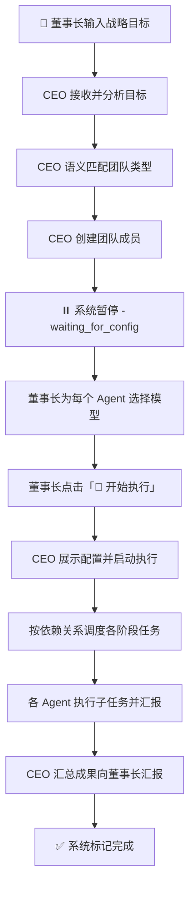

# Multi-Agent 协作平台 (Enterprise Multi-Agent Orchestration)

一个基于现代浏览器环境的可视化多智能体（Multi-Agent）任务编排与协同执行平台。

本项目将现代企业治理结构（董事长-CEO-专业域员工）抽象为 Agent 间的层级协作关系，将复杂的宏观商业目标通过自然语义拆解，实现真正的自动化系统流转。

![平台概览图落位预留]

## 🌟 核心流程流转



### 流程说明

| 阶段 | 状态 | 负责方 | 说明 |
|-----|------|-------|------|
| 1. 发布目标 | `running` | 董事长 | 输入框输入目标并点击"发布" |
| 2. 分析目标 | CEO:`planning` | CEO | 语义分析目标关键词，智配匹配场景团队 |
| 3. 组建团队 | CEO:`executing` | CEO | 动态创建团队成员，自动预分配合适的 AI 模型 |
| **4. 等待配置** | **`waiting_for_config`** | **董事长** | **⏸ CEO 暂停执行，等待董事长核对配置模型** |
| 5. 确认执行 | `running` | 董事长 | 点击"🚀 开始执行"，CEO 恢复工作流 |
| 6. 任务执行 | 各 Agent:`executing` | 全体 | 按依赖关系组别并发执行各细分阶段 |
| **7. 人工介入** | **`waiting_for_human`** | **董事长** | **🚨 遇“扫码、支付、验证”等敏感操作，CEO 将主动拦截任务并呼叫董事长接入数据** |
| 8. 成果汇报 | CEO:`reviewing` | CEO | 收集各 Agent 成果，产出总结方案 |
| 9. 完成项目 | `completed` | 系统 | 标记完成，可重置 |

## ✨ 核心特性

- 🏢 **企业化层级架构**
  - **董事长 (Human)**：只负责发布宏观目标（如：“开发一个电商小程序”或“在抖音上起号赚钱”），并在关键节点（需要扫码、支付等）提供人工授权。
  - **CEO (Orchestrator)**：接收目标，基于语义分析智能匹配所需专业团队（开发、营销、商业等），调度任务执行与依赖控制。
  - **专业员工 (Worker)**：分阶段完成细分任务，能力互补透明协作。

- 🧠 **智能团队匹配与模型分发**
  - 内置 7 大行业高频场景的语义拆解引擎。
  - 支持多达 10 家国内外主流大模型 API 接入。
  - CEO 根据新员工的专业职能，自动为其智能派发最合适的大语言模型（如给程序员指派 DeepSeek，给文案指派 Opus）。

- ⏸️ **安全感拉满的 HITL (Human-in-the-loop) 机制**
  - 执行沙盘全程可见；
  - 内置操作风险嗅探器，当专业 Agent 执行遇到如“扫码注册”、“人脸识别”等操作时，全局引擎自动挂起并弹窗，等待董事长安全接管输入后再无缝恢复。

- 🎨 **极致纯粹的工程设计**
  - 无依赖地构建复杂的弹性响应式管理界面（不依赖外部 UI 框架）。
  - 基于 Zustand 的细粒度状态管理。

## 🛠 技术栈

- **框架**：React 18 (Vite 环境)
- **状态管理**：Zustand
- **样式**：原生 Vanilla CSS3 + Variables
- **其他层**：纯前端逻辑，无独立后端依赖，跨源请求直连大模型 API

## 🚀 快速启动

### 前置要求
- Node.js (建议 v18+)
- 包管理器 (npm / yarn)

### 安装与运行

```bash
# 1. 克隆代码
git clone [repository-url]
cd agentAuto

# 2. 安装依赖
npm install

# 3. 启动开发服务器
npm run dev
```

打开浏览器访问终端输出的本地地址（默认通常是 `http://localhost:5173`）。

## ⚙️ 模型配置与使用手册

1. **设置 API Key**：
   - 启动应用后，点击右侧侧边栏的 **“⚙️ 配置”** 标签。
   - 系统内置了对 OpenAI, Anthropic, Google, DeepSeek, 智谱等模型的请求适配。
   - 输入您持有的任意厂商 API Endpoint 和 API Key（数据仅存储在浏览器 localStorage 中）。

2. **下发任务**：
   - 在左上角输入想要测试的宏观目标，例如：“计划开发一款本地生活微信小程序”。
   - 点击**发布**，观察系统自动分工和实时通信。

3. **人工接管 (HITL 测试)**：
   - 输入涉及账号强安全的目标，如：“帮我在小红书注册个账号发文”。
   - 当任务流执行到相关节点时，系统会自动暂停，您可在弹出的红框内模拟输入验证码放行。

## 📖 TODO & 未来的演进计划

- [ ] **物理连接**：将虚构的前端延时 Mock 替换为真正的 WebSockets 以调用 LLM 模型。
- [ ] **日志导出**：支持导出此次 Agent 执行的全量履历和生成产物至 Markdown 文件。
- [ ] **执行中断**：支持董事长在运行中强制中断重构团队职能。

## 📄 协议
目前作为概念可行性（PoC）验证项目内部使用。
