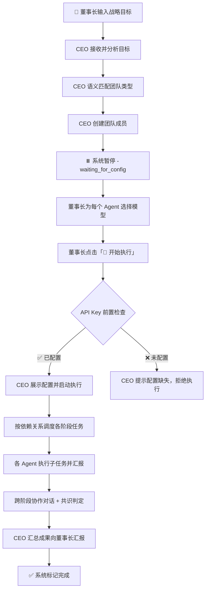

# AI Team Engine - 多Agent协调系统

一个基于现代浏览器环境的可视化多智能体（Multi-Agent）任务编排与协同执行平台。

本项目将现代企业治理结构（董事长-CEO-专业域员工）抽象为 Agent 间的层级协作关系，将复杂的宏观商业目标通过自然语义拆解，实现真正的自动化系统流转。

## 🌟 核心流程流转



### 流程说明

| 阶段 | 状态 | 负责方 | 说明 |
|-----|------|-------|------|
| 1. 发布目标 | `running` | 董事长 | 输入框输入目标并点击"发布" |
| 2. 分析目标 | CEO:`planning` | CEO | 语义分析目标关键词，智配匹配场景团队 |
| 3. 组建团队 | CEO:`executing` | CEO | 动态创建团队成员，自动预分配合适的 AI 模型（复用已有同名 Agent） |
| **4. 等待配置** | **`waiting_for_config`** | **董事长** | **⏸ CEO 暂停执行，等待董事长核对配置模型** |
| 5. API Key 检查 | `running` | CEO | 验证所有 Agent 的 Provider 是否已配置 API Key/URL |
| 6. 确认执行 | `running` | 董事长 | 点击"🚀 开始执行"，CEO 恢复工作流 |
| 7. 任务执行 | 各 Agent:`executing` | 全体 | 按依赖关系组别并发执行各细分阶段 |
| **8. 人工介入** | **`waiting_for_human`** | **董事长** | **🚨 遇"扫码、支付、验证"等敏感操作，CEO 将主动拦截** |
| 9. 成果汇报 | CEO:`reviewing` | CEO | 收集各 Agent 成果，附带详细成果产出报告 |
| 10. 完成项目 | `completed` | 系统 | 标记完成，可重置或恢复历史会话 |

## ✨ 核心特性

- 🏢 **企业化层级架构**
  - **董事长 (Human)**：只负责发布宏观目标（如："开发一个电商小程序"），并在关键节点提供人工授权。
  - **CEO (Orchestrator)**：接收目标，基于语义分析智能匹配所需专业团队，调度任务执行与依赖控制。
  - **专业员工 (Worker)**：分阶段完成细分任务，能力互补透明协作。

- 🧠 **智能团队匹配与模型分发**
  - LLM 驱动的语义拆解引擎，动态分析目标并智能组建团队。
  - 支持多达 10 家国内外主流大模型 API 接入。
  - CEO 通过 LLM 分析角色职能，自动为每位 Agent 推荐最合适的大语言模型。
  - **Agent 复用**：同名角色自动复用，避免重复创建。

- ⚡ **并行执行引擎**
  - 自动识别无依赖关系的阶段，`Promise.all` 并发调度多个 Agent 同时执行。
  - 大幅缩短总执行时间，CEO 实时汇报并行状态。

- ⏸️ **执行中断与热重组**
  - 董事长可在运行中随时暂停执行，动态增删团队成员、调整职责和模型。
  - 重组完成后一键恢复，从暂停点继续，无需重头开始。

- 🛡️ **安全感拉满的 HITL 机制**
  - 执行沙盘全程可见。
  - 内置 LLM 语义风险嗅探器，敏感操作（登录、支付、授权等）自动暂停，等待董事长安全接管。
  - API Key 前置检查，未配置时 CEO 明确提示并拒绝执行。

- 🧠 **Agent 记忆与学习**
  - 每个 Agent 拥有持久化记忆模块，跨会话保留专业领域经验。
  - 后续任务自动参考历史产出，持续提升质量。

- ✅ **质量自动审核 (Self-Review)**
  - 每个阶段产出后，CEO 自动调用 LLM 进行质量评审。
  - 不达标则触发修订循环，确保交付物质量。

- 🔄 **会话管理与上下文连续性**
  - 会话归档与恢复：历史会话可一键加载，恢复 Agent 状态和产出。
  - **跨会话上下文注入**：新会话自动携带前次会话的目标和关键产出摘要。
  - 文件日志系统：按会话分文件存储，便于排查问题。

- 📄 **交付物多格式导出**
  - 支持将交付报告导出为 Markdown / HTML / PDF 三种格式。
  - HTML 带完整样式，PDF 通过浏览器打印生成。

- 💰 **成本与 Token 监控**
  - 实时追踪每个 Agent 的 Token 消耗和 API 调用成本。
  - 按 Agent / 模型分布可视化仪表盘。

- 🔍 **Prompt 可视化调试**
  - Prompt Inspector 面板，实时展示每次 LLM 调用的完整 prompt、响应、耗时和 token 数。
  - 支持搜索过滤，便于调优和排障。

- ⏱️ **任务执行回放**
  - 完整执行过程存储为时间线事件（状态变化、协作对话、决策节点）。
  - 可视化回放播放器，支持拖动进度条和逐步查看。

- 🔧 **Agent 工具调用 (Tool Use)**
  - 工具注册中心，内置计算器、时间查询、搜索等工具。
  - 支持自定义扩展，LLM 响应中自动解析工具调用意图。

- 🔌 **MCP 协议支持**
  - 接入 Model Context Protocol，通过 MCP Server 连接企业内部系统。
  - 工具自动发现与调用。

- 📚 **知识库对接 (RAG)**
  - 前端轻量 RAG 引擎，支持文档上传和关键词检索。
  - 检索结果自动注入 Agent prompt 作为参考。

- 🧩 **插件化 Agent 生态**
  - 插件注册中心，内置电商和内容创作两个团队模板。
  - 支持自定义角色模板和工具链，可启用/禁用。

- 📈 **Agent 性能评估体系**
  - 追踪产出质量、响应速度、任务完成率，加权计算 0-100 评分。
  - Agent 排名面板，持续优化模型和 Prompt 配置。

- 🌐 **多模态 Agent**
  - 支持图片输入输出，消息气泡自动渲染图片内容。

- 👥 **多人协作模式**
  - 多工作区管理，支持不同业务线独立运作。
  - 定义了完整的后端 WebSocket 同步接口规范。

- 🎨 **极致纯粹的工程设计**
  - 无依赖地构建复杂的弹性响应式管理界面（不依赖外部 UI 框架）。
  - 基于 Zustand 的细粒度状态管理。
  - **10 个功能面板**：进度 / 成本 / 回放 / 日志 / 协作 / 报告 / 知识库 / 插件 / 调试 / 配置。

## 🛠 技术栈

- **框架**：React 18 (Vite 环境)
- **状态管理**：Zustand
- **样式**：原生 Vanilla CSS3 + Variables
- **日志**：前端 Logger + Vite 插件写文件
- **其他层**：纯前端逻辑，无独立后端依赖，跨源请求直连大模型 API
- **后端部署**：可选，详见 [DEPLOYMENT.md](./DEPLOYMENT.md)

## 🚀 快速启动

### 前置要求
- Node.js (建议 v18+)
- 包管理器 (npm / yarn)

### 安装与运行

```bash
# 1. 克隆代码
git clone https://github.com/hudijiang/ai-team-engine.git
cd ai-team-engine

# 2. 安装依赖
npm install

# 3. 启动开发服务器
npm run dev
```

打开浏览器访问终端输出的本地地址（默认通常是 `http://localhost:5173`）。

## ⚙️ 模型配置与使用手册

1. **设置 API Key**：
   - 启动应用后，点击右侧侧边栏的 **"⚙️ 配置"** 标签。
   - 系统内置了对 OpenAI, Anthropic, Google, DeepSeek, 智谱等模型的请求适配。
   - 输入您持有的任意厂商 API Endpoint 和 API Key（数据仅存储在浏览器 localStorage 中）。

2. **下发任务**：
   - 在左上角输入想要测试的宏观目标，例如："计划开发一款本地生活微信小程序"。
   - 点击**发布**，观察系统自动分工和实时通信。

3. **会话管理**：
   - 对话面板顶部显示历史会话卡片，点击 🔄 按钮可恢复任意历史会话。
   - 新会话自动继承前次会话的上下文，Agent 能理解连续提问。

4. **人工接管 (HITL 测试)**：
   - 输入涉及账号强安全的目标，如："帮我在小红书注册个账号发文"。
   - 当任务流执行到相关节点时，系统会自动暂停，您可在弹出的红框内模拟输入验证码放行。

## 📖 未来展望

随着核心引擎趋于成熟，后续将重点探索：

- **真实工具执行沙箱**：集成 WebContainer 或后端沙箱，让 Agent 真正执行代码和操作浏览器。
- **企业级后端部署**：基于 Node.js/Python 实现完整后端，参见 [部署指南](./DEPLOYMENT.md)。
- **Agent 自我进化**：基于性能评估数据自动调整 Prompt 策略和模型选配。
- **可视化工作流编辑器**：拖拽式编排 Agent 协作流程，降低使用门槛。

## 📄 协议
目前作为概念可行性（PoC）验证项目内部使用。
