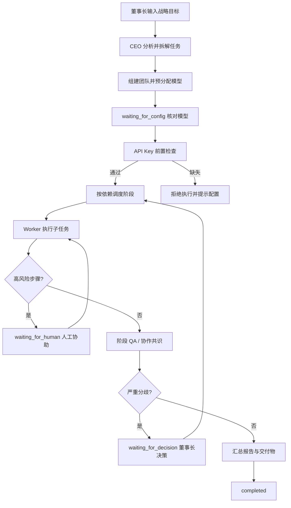

# AI Team Engine

**中文** | [English](./README.en.md)

浏览器端可视化多智能体（Multi-Agent）任务编排与协同执行引擎。

用「董事长 → CEO → 专业员工」的层级协作，把自然语言战略目标拆成可调度阶段，由 LLM Worker 并行执行，并在关键节点引入人工确认（HITL）。

> **定位**：本地单用户 / 内部 PoC / **BYOK（自带密钥）技术预览**。  
> **不是**企业级多租户 SaaS，也不承诺商用 SLA、合规审计或托管密钥。详见 [产品定位](#产品定位与商用边界)。

---

## 核心流程


```mermaid
flowchart TD
    A[董事长输入战略目标] --> B[CEO 分析并拆解任务]
    B --> C[组建团队并预分配模型]
    C --> D[waiting_for_config 核对模型]
    D --> E[API Key 前置检查]
    E -->|通过| F[按依赖调度阶段]
    E -->|缺失| G[拒绝执行并提示配置]
    F --> H[Worker 执行子任务]
    H --> I{高风险步骤?}
    I -->|是| J[waiting_for_human 人工协助]
    J --> H
    I -->|否| K[阶段 QA / 协作共识]
    K --> L{严重分歧?}
    L -->|是| M[waiting_for_decision 董事长决策]
    M --> F
    L -->|否| N[汇总报告与交付物]
    N --> O[completed]
```

### 状态一览

| 阶段 | `systemStatus` | 说明 |
|------|----------------|------|
| 发布目标 | `running` | 董事长提交宏观目标 |
| 拆解与组队 | `running` | CEO 语义拆解、创建/复用 Agent |
| 核对配置 | `waiting_for_config` | 为各 Agent 选定模型后「开始执行」 |
| 并行执行 | `running` | 按依赖分组 `Promise.all` 调度 |
| 人工协助 | `waiting_for_human` | 登录/支付/验证等敏感步骤 fail-closed 拦截 |
| 决策门禁 | `waiting_for_decision` | 协作未共识时上报方案供董事长选择 |
| 暂停/恢复 | `paused` | 可热重组团队；刷新后可恢复检查点 |
| 结束 | `completed` / `blocked` | 成功完成或阻塞（含跳过/失败路径） |

---

## 核心能力

### 编排与执行

- **企业化层级**：董事长（人）定目标与关键授权；CEO 拆解、调度、QA 与汇报；Worker 分阶段产出。
- **LLM 任务拆解**：动态团队与阶段依赖；同名角色可复用。
- **并行调度**：无依赖阶段并发执行；同 assignee 串行，避免同一 Agent 状态冲突。
- **类型化结果**：子任务/阶段使用 `success` / `failed` / `blocked` / `skipped` 等状态；模板回退、跳过与工具拒绝**不计为成功**。
- **阶段 QA**：收尾自动评审；不达标可修订一轮，避免空泛交付直接进报告。

### 人机协同（HITL / 决策）

- **统一用户门禁**：人工协助与董事长决策共用互斥锁 + **generation 令牌**，`stop` 后作废排队与在途写状态，降低竞态复活。
- **高风险 fail-closed（双通道）**：关键词/角色命中立即拦截；未命中再由 LLM 判 YES/NO；无模型、不可解析或调用失败一律要求介入。超时只升级告警，**不自动跳过当成功**。英文绕写仍可能漏拦。
- **凭据不透明**：HITL 输入默认不进 Prompt / 对话原文；公开确认文案脱敏。
- **决策恢复**：热态与冷恢复均会提升检查点，并把已决策阶段移出 `inFlight`，避免刷新后重放。

### 检查点与可恢复性

- **运行中检查点** `running_execution`：记录已完成阶段、失败列表、子任务级 `inFlight`。
- **门禁检查点**：`waiting_for_config` / `waiting_for_human` / `waiting_for_decision` 可在刷新后恢复。
- **原子提升（promote）**：从门禁回到 running 时先合并 `runningSnapshot` 再写入，缩小「先 clear 再写」窗口。
- **Abort 作用域**：`stop` 取消进行中的 LLM/SSE，唤醒暂停与挂起 Promise，状态不落在 `waiting_for_*`。

### 工具与策略

- **工具注册中心**：内置只读类工具（时间、计算等）；自定义工具不可覆盖内置名。
- **工具策略**：默认拒绝高风险 / 未知自定义工具。配置里的「MCP」实为简化 HTTP（`/tools/list`、`/tools/call`），**不是**官方 MCP / SSE；默认 high_risk，需显式放行才会调用。
- **审计预览脱敏**：工具参数与错误信息经敏感信息过滤后再入时间线/日志。

### 隐私与可观测

- **敏感数据脱敏**：消息边界、日志、时间线、交付报告对常见密钥/验证码模式脱敏（见 `src/utils/sensitiveData.js`）。
- **密钥存储**：完整 API Key 在 IndexedDB；`localStorage` 仅 bootstrap 去敏缓存。
- **成本 / Token**：按 Agent、模型追踪消耗。
- **Prompt Inspector / 时间线回放**：调试与过程回看（本地 PoC 级别）。

### UI 与交付

- **十类侧栏面板**：进度、成本、回放、日志、协作、报告、知识库、插件、调试、配置。
- **交付物导出**：Markdown / HTML / PDF（浏览器打印）。
- **会话归档**：历史会话恢复与跨会话摘要注入。

部分能力为演示骨架：关键词知识库（非向量 RAG）、角色插件模板、简化 HTTP 工具桥、多人协作数据结构。**本仓库没有可部署的后端实现**；控制平面仍是规划，见 [DEPLOYMENT.md](./DEPLOYMENT.md)。

---

## 技术栈

| 层 | 选型 |
|----|------|
| UI | React 19 + Vite 7 |
| 状态 | Zustand（双存储：localStorage bootstrap + IndexedDB full） |
| 样式 | 原生 CSS Variables（无外部 UI 框架） |
| 编排核心 | `src/engine/ceoAgent.js` 及周边模块 |
| 安全相关 | CSP（`index.html`）、DOMPurify、`sensitiveData`、工具策略 |
| 后端 | 默认无；浏览器直连你配置的模型 API（BYOK） |

### 引擎模块（简图）

```
src/engine/
  ceoAgent.js           # 生命周期、调度、HITL/决策门禁
  executionControl.js   # 互斥锁、暂停栅栏、中止语义
  workflowCheckpoint.js # 运行/门禁检查点与 inFlight
  executionResult.js    # 类型化步骤状态
  llmClient.js          # 多供应商请求、Abort/SSE 取消
  toolPolicy.js         # 工具风险与放行
  capabilityRuntime.js  # 工具执行与审计
  taskDecomposer.js     # 目标拆解
  modelConfig.js        # 供应商与密钥（IndexedDB）
  timelineRecorder.js   # 时间线（脱敏）
src/utils/sensitiveData.js
src/store/store.js + storeRecovery.js
```

---

## 快速开始

### 要求

- Node.js **18+**（建议 20+）
- npm

### 安装与运行

```bash
git clone https://github.com/hudijiang/ai-team-engine.git
cd ai-team-engine
npm install
npm run dev
```

浏览器打开终端提示的地址（默认多为 `http://localhost:5173`）。

### 测试与构建

```bash
npm test          # Node 原生 test runner 回归
npm run check     # test + production build
npm run build     # tsc && vite build
```

仓库可配置 CI 执行 `npm run check`。

---

## 使用手册

1. **配置模型**  
   右侧 **⚙️ 配置**：填写供应商 Endpoint 与 API Key（OpenAI / Anthropic / Google / DeepSeek / 智谱等适配）。密钥落在本机浏览器存储。

2. **发布目标**  
   例如：`计划开发一款本地生活微信小程序` → **发布** → 核对团队与模型 → **开始执行**。

3. **人工协助（HITL）**  
   遇到登录/支付等步骤会暂停。请确认已在外部完成操作后输入简要确认，或显式跳过（记为 **skipped**，不计成功）。**不要**在对话中粘贴真实验证码/生产密钥。

4. **决策分歧**  
   多轮协作未共识时，选择方案或输入自定义决策后继续。

5. **停止 / 暂停 / 刷新**  
   - **停止**：取消 LLM、作废门禁 generation、清理挂起回调。  
   - **暂停**：可重组团队后恢复。  
   - **刷新**：可恢复的检查点会进入安全恢复路径（见 `storeRecovery`）。

6. **会话**  
   历史会话可加载；新会话可携带前次目标与关键产出摘要。

---

## 产品定位与商用边界

当前范围是**单租户 / 本机 BYOK**。多租户隔离与跨租户账单**不是**本阶段 P0。

| 适合 | 不适合（当前版本） |
|------|-------------------|
| 本地演示、内部 PoC | 对外收费 SaaS |
| BYOK 自研试验 | 密钥托管、关标签页后继续跑任务 |
| 编排与 HITL 流程验证 | 强合规审计 / SLA |

**已知边界：**

- 无独立 Gateway / 任务队列；执行在浏览器标签页生命周期内。
- 请求从**浏览器**发往你填写的 URL：存在密钥与 Prompt 外泄、恶意反向代理、访问本机/内网服务等风险。这不是服务端 SSRF；将来 Gateway 代发请求时才需要单独防 SSRF（URL 白名单等）。
- 脱敏为尽力模式，不能 100% 覆盖所有语言与格式。
- 内置工具默认只读；真实联网搜索、代码沙箱、标准 MCP 需另接。
- 无服务端删除/导出合规流程。

**单租户若要接近可交付，阻塞项是：** 密钥托管、持久执行、审计、限流、主路径 E2E。不是多租户账单。

更多说明：[PRIVACY.md](./PRIVACY.md) · [DEPLOYMENT.md](./DEPLOYMENT.md)

---

## 路线图（方向性）

并行推进，避免「先拆完 3800 行 CEO 再做 Gateway」的大爆炸：

1. **增量拆分**：门禁已抽出 `src/engine/gateController.js`；下一步是阶段运行器
2. **最小单租户 Gateway**：`npm run gateway` 可代调 chat、托管密钥，并用 `POST/GET/PATCH /api/runs` 与本地检查点对账（见 [gateway/README.md](./gateway/README.md)）。关页后 **Agent 不会继续跑**
3. 主路径 Playwright / 真实供应商烟雾测试
4. 其后：工具沙箱、可视化编排；多租户放到单租户控制平面稳定之后

---

## 协议

[MIT License](./LICENSE) — 以开源 PoC / 技术预览方式提供，**不附带商用 SLA 或安全认证声明**。
