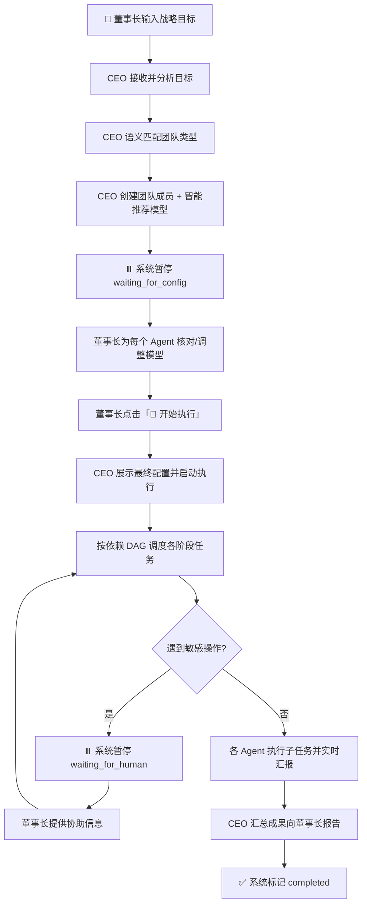
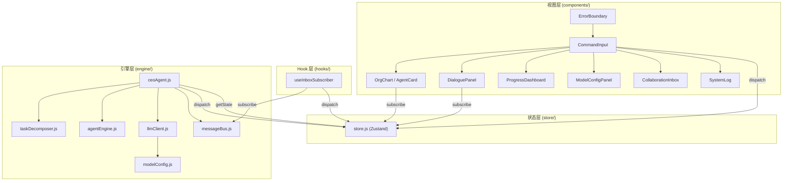
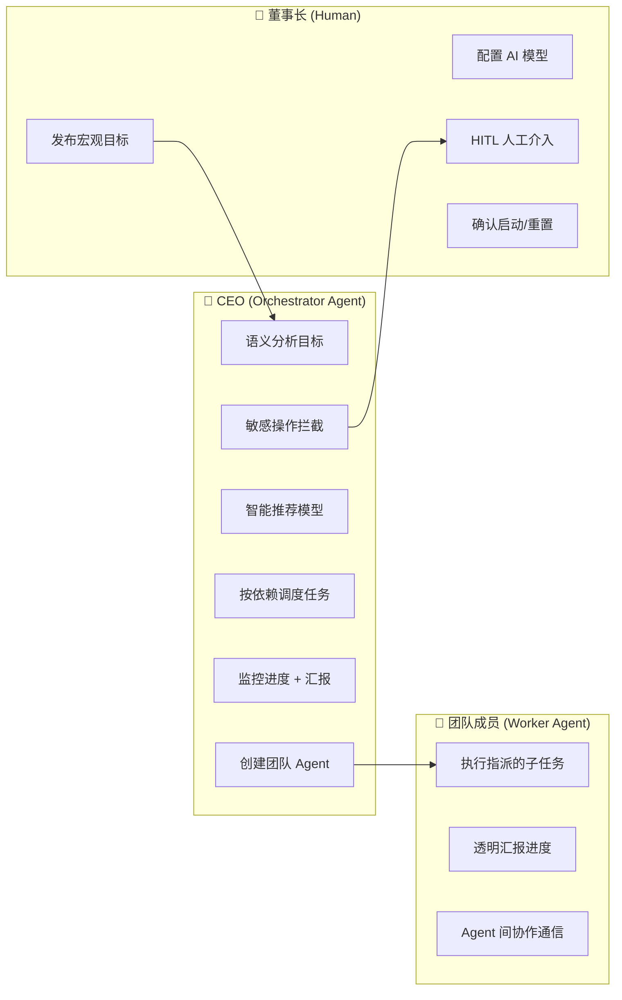
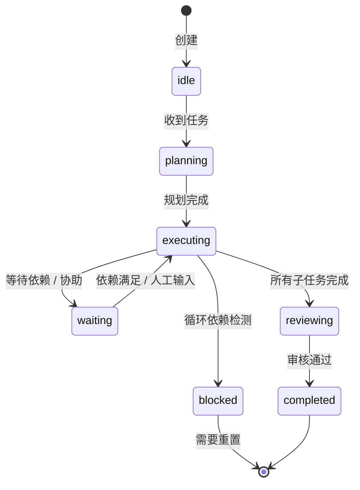
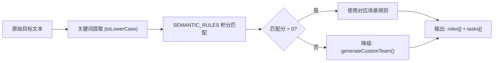
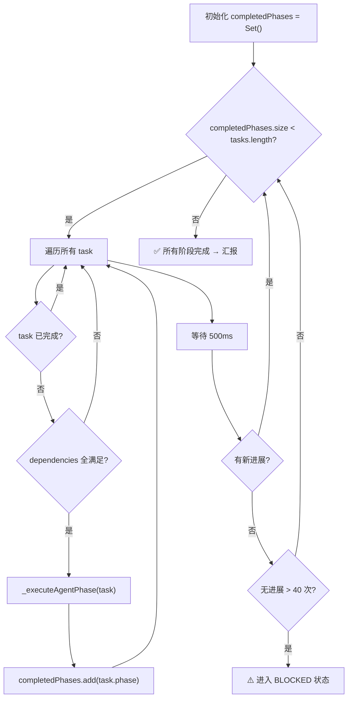
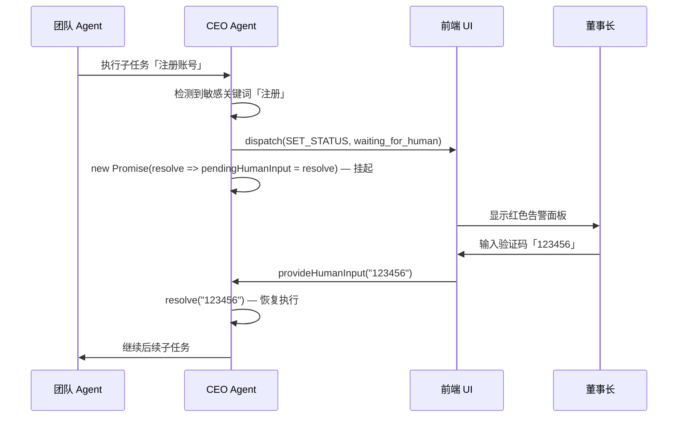

# Multi-Agent 协作平台 — 系统详细设计文档

> **版本**：v2.0 &nbsp;|&nbsp; **更新日期**：2026-03-02  
> **系统定位**：基于现代浏览器环境的可视化多智能体任务编排与协同执行平台

---

## 1. 项目概述与设计哲学

### 1.1 系统定位

agentAuto 是一个将**现代企业治理结构**（董事长 → CEO → 专业域员工）抽象为 Agent 层级协作关系的可视化平台。用户只需输入一句宏观商业/技术目标，系统即可自动完成：语义分析 → 团队组建 → 模型分配 → 依赖调度 → 并发执行 → 成果汇报的全链路自动化编排。

### 1.2 核心设计原则

| 原则 | 说明 |
|------|------|
| **企业治理隐喻** | 三级权限分离（董事长/CEO/员工），职责清晰、不可越权 |
| **安全感优先** | HITL（Human-in-the-loop）机制，敏感操作强制暂停等待人工确认 |
| **透明可审计** | 所有 Agent 通信全局可见，支持 JSON 结构化数据展开 |
| **零后端依赖** | 纯前端架构，API Key 仅存 localStorage，直连各大模型 API |
| **语义驱动编排** | 基于关键词积分匹配的智能任务拆解，非硬编码模板绑定 |

---

## 2. 系统全局流转

### 2.1 主流程图



### 2.2 状态流转表

| 阶段 | 系统状态 | 负责方 | 说明 |
|------|---------|--------|------|
| 1. 发布目标 | `running` | 董事长 | 在输入框键入目标并点击「发布」 |
| 2. 分析目标 | CEO:`planning` | CEO | 语义分析关键词，匹配最佳场景规则 |
| 3. 组建团队 | CEO:`executing` | CEO | 动态创建 Agent，自动为每人推荐 AI 模型 |
| 4. 等待配置 | **`waiting_for_config`** | **董事长** | ⏸ CEO 暂停，等待董事长核对/调整模型配置 |
| 5. 确认执行 | `running` | 董事长 | 点击「🚀 开始执行」，CEO 恢复工作流 |
| 6. 任务执行 | 各 Agent:`executing` | 全体 | 按依赖关系分组并发执行各阶段 |
| 7. 人工介入 | **`waiting_for_human`** | **董事长** | 🚨 遇到扫码/支付/验证等敏感操作，CEO 主动拦截并呼叫董事长 |
| 8. 成果汇报 | CEO:`reviewing` | CEO | 收集各 Agent 成果，产出总结方案 |
| 9. 项目完成 | `completed` | 系统 | 标记完成，可重置 |

---

## 3. 系统架构

### 3.1 技术栈

| 层级 | 技术选型 | 选型理由 |
|------|---------|---------|
| 构建工具 | Vite 7 | 极速 HMR，ESM 原生支持 |
| 视图框架 | React 19 (Hooks) | 声明式 UI + 函数组件 + StrictMode |
| 状态管理 | Zustand 5 | 轻量无模板，Selector 级渲染优化 |
| 动画 | Framer Motion | 组件级过渡动画（已引入但待深度集成） |
| 样式系统 | Vanilla CSS3 | CSS Variables 驱动，深色科技风主题，无第三方 UI 框架侵入 |
| ID 生成 | uuid v13 | 全局唯一 Agent/消息标识 |
| 类型检查 | TypeScript 5.9（仅 check） | `tsconfig.json` 配置 `allowJs + checkJs:false`，源码为 JSX |

### 3.2 分层架构



### 3.3 目录结构

```
src/
├── main.jsx                    # 应用入口，挂载 ErrorBoundary + App
├── App.jsx                     # 三栏布局容器（组织架构 | 对话流 | 侧边板）
├── index.css                   # 全局样式系统（~1500 行，CSS Variables 驱动）
│
├── components/                 # React 视图组件
│   ├── ErrorBoundary.jsx       # 全局错误边界，防止渲染异常导致白屏
│   ├── CommandInput.jsx        # 董事长指令输入 + HITL 人工介入面板
│   ├── OrgChart.jsx            # 组织架构树形可视化
│   ├── AgentCard.jsx           # Agent 卡片（角色信息 + 模型下拉 + 进度条）
│   ├── DialoguePanel.jsx       # 对话流面板（角色过滤 / JSON 展开 / 自动滚动）
│   ├── ProgressDashboard.jsx   # SVG 圆环进度 + Agent 进度列表 + 状态统计
│   ├── ModelConfigPanel.jsx    # 多供应商 API 配置 + 在线拉取模型列表
│   ├── CollaborationInbox.jsx  # Agent 间 @协作消息收件箱
│   └── SystemLog.jsx           # 系统审计日志流
│
├── engine/                     # 业务逻辑与引擎核心
│   ├── ceoAgent.js             # ★ CEO Agent 运行器（核心状态机 + 调度引擎）
│   ├── taskDecomposer.js       # 语义分析 + 任务拆解 + 动态团队生成
│   ├── agentEngine.js          # Agent 工厂 + 状态枚举 + 对话模板 + 模型列表
│   ├── llmClient.js            # LLM 客户端（OpenAI/Anthropic 兼容 + SSE 流式）
│   ├── messageBus.js           # 发布/订阅消息总线（单例，Agent 间通信）
│   └── modelConfig.js          # 9 大供应商配置 + localStorage 持久化 + 模型缓存
│
├── hooks/
│   └── useInboxSubscriber.js   # 监听 messageBus 广播，自动写入 inbox store
│
└── store/
    └── store.js                # Zustand 全局状态 + Reducer 模式 dispatch
```

---

## 4. 核心机制详解

### 4.1 三级权限架构

系统严格区分三级权限，任何角色不可越权操作：



**权限边界**：
- **董事长**：只能输入目标、配置模型、提供人工数据、确认执行。不直接参与任务拆解或执行。
- **CEO**：唯一可以「创建 Agent」「拆解任务」「调度执行」的角色。不能修改董事长的模型选择（只推荐）。
- **团队成员**：只能在指定阶段执行被分配的子任务，输入输出全程透明广播。

### 4.2 Agent 生命周期状态机

每个 Agent 实例均遵循以下状态机流转（定义于 `agentEngine.js` 的 `AGENT_STATES`）：



**状态定义**：

| 状态 | 枚举值 | 颜色标识 | 说明 |
|------|--------|---------|------|
| 空闲 | `idle` | `#6B7280` | 初始状态，等待任务指派 |
| 规划中 | `planning` | `#8B5CF6` | 分析任务需求，制定执行计划 |
| 执行中 | `executing` | `#3B82F6` | 逐个推进子任务 |
| 等待中 | `waiting` | `#F59E0B` | 等待前置依赖完成或董事长协助 |
| 阻塞 | `blocked` | `#EF4444` | 检测到循环依赖等异常 |
| 审核中 | `reviewing` | `#EC4899` | 检查产出质量 |
| 已完成 | `completed` | `#10B981` | 全部交付物就绪 |

### 4.3 任务拆解引擎 (`taskDecomposer.js`)

CEO 在接收到目标后，执行以下智能拆解流程：



#### 4.3.1 语义规则库（7 大内置场景）

| 场景类型 | 触发关键词（部分） | 生成角色 | 典型阶段数 |
|---------|------------------|---------|-----------|
| 商业策略 | 赚钱、盈利、创业、副业、投资 | 商业分析师 + 市场策划 + 运营专家 + 财务分析师 | 4 |
| 软件开发 | 开发、编程、小程序、网站、API | 产品经理 + UI设计师 + 前端/后端工程师 + 测试 | 5 |
| 营销推广 | 营销、推广、品牌、获客、引流 | 市场策划 + 内容创作者 + 设计师 + 数据分析师 | 4 |
| 内容创作 | 自媒体、短视频、抖音、小红书、直播 | 内容创作者 + 视频制作 + 设计师 + 运营专家 | 4 |
| 研究分析 | 研究、分析、调研、报告、论文 | 首席研究员 + 数据分析师 + 报告撰写员 | 3 |
| 教育培训 | 教育、培训、课程、教学 | 课程设计师 + 讲师 + 内容创作者 | 3 |
| 方案规划 | 方案、计划、规划、战略、路线图 | 商业分析师 + 项目经理 + 质量专员 | 3 |

#### 4.3.2 降级策略

当目标不匹配任何规则（积分 = 0）时，CEO 自动构造通用三人团队：

- **首席策划师**：深度分析 + 制定路线图
- **执行负责人**：按路线图推进 + 阶段交付
- **质量审核员**：成果评估 + 优化建议

#### 4.3.3 角色库

系统内置 **20+ 个标准化角色**（位于 `ROLE_LIBRARY`），按 6 大分类组织：商业（5）、技术（6）、创意内容（4）、研究（3）、教育（2）、管理（2）。每个角色包含预定义的职责描述、色彩标识和分类标签。

### 4.4 CEO Agent 运行器 (`ceoAgent.js` — 系统核心)

`CEOAgentRunner` 是整个系统的引擎核心，以 class 实例形式管理完整的任务生命周期。

#### 4.4.1 生命周期方法

| 方法 | 说明 |
|------|------|
| `start(objective)` | 接收目标 → 拆解 → 组建团队 → 推荐模型 → 暂停等待配置 |
| `resume()` | 董事长确认后恢复 → 展示配置 → 驱动并发执行 |
| `provideHumanInput(input)` | 接收董事长人工介入数据，resolve 挂起的 Promise |
| `stop()` | 中止执行：设置 `_aborted` 标志 + 清理所有 timer + 释放 pending 状态 |

#### 4.4.2 依赖调度算法



**关键机制**：
- **非阻塞轮询**：`while` 循环 + `await _delay(500ms)` 实现依赖检测
- **死锁检测**：`noProgressTicks` 计数器，连续 40 次（≈20 秒）无进展则判定依赖异常，进入 `BLOCKED`
- **安全中止**：每个 `await _delay()` 后检查 `_aborted` 标志，`stop()` 后 async 链立即终止

#### 4.4.3 智能模型推荐 (`_autoRecommendModel`)

CEO 在创建团队成员时，根据角色名称中的关键词自动匹配最合适的 AI 模型：

| 角色关键词 | 推荐模型优先级 |
|-----------|--------------|
| 前端、后端、架构、测试、开发、工程师、代码 | Sonnet > GPT-4 > DeepSeek |
| 文案、内容、策划、报告、设计师、创意 | Opus > GPT-4 |
| 分析、数据、研究、财务 | DeepSeek R1 > GPT-5 > Opus |

模型来源优先级：已配置的供应商 API 返回的模型列表 → 内置静态模型列表 → 列表首个模型（兜底）。

### 4.5 HITL 人工介入机制

系统内置运行时安全拦截器，通过 Promise 挂起/恢复模式实现全流程无缝人工接管。



**敏感词触发列表**（位于 `_executeAgentPhase`）：
`登录` | `验证码` | `扫码` | `确认账号` | `支付` | `人脸` | `绑定`

### 4.6 LLM 客户端 (`llmClient.js`)

#### 4.6.1 Provider 适配体系

系统通过适配器模式（Adapter Pattern）统一不同 LLM 供应商的 API 差异：

| 适配器 | endpoint | auth header | body 格式 | 响应解析 |
|--------|----------|-------------|----------|---------|
| `openai` / `gptge` / `custom` | `/chat/completions` | `Authorization: Bearer` | OpenAI 标准 | `choices[0].message.content` |
| `anthropic` | `/messages` | `x-api-key` + `anthropic-version` | system 分离 + max_tokens | `content[0].text` |

#### 4.6.2 SSE 流式输出

流式模式下使用 `ReadableStream` + `TextDecoder` 实时解析 SSE 事件：
1. 将 body chunk 拼接到 buffer
2. 按 `\n\n` 分割事件边界
3. 提取 `data:` 前缀的 JSON payload
4. 解析 `choices[0].delta.content` 逐 token 回调
5. 累积完整内容直接返回（不再二次 `res.json()`）

#### 4.6.3 降级策略

LLM 调用失败时，自动回退到 `DIALOGUE_TEMPLATES` 模板输出（定义于 `agentEngine.js`），确保流程不中断。模板覆盖 7 种场景：`taskReceived` / `planning` / `executing` / `subtaskComplete` / `collaborating` / `waiting` / `reviewing` / `completed`。

### 4.7 消息总线 (`messageBus.js`)

单例模式的发布/订阅消息系统，承载 Agent 间通信：

| 功能 | 方法 | 说明 |
|------|------|------|
| 频道订阅 | `subscribe(channel, cb)` | 返回 unsubscribe 函数 |
| 消息发布 | `publish(channel, msg)` | 自动添加 id/timestamp，通知频道 + `*` 广播订阅者 |
| Agent 直发 | `sendAgentMessage(from, to, msg)` | 发布到 `agent:{toId}` 频道 |
| 系统广播 | `broadcastEvent(type, data)` | 发布到 `system` 频道 |
| 历史查询 | `getHistory(filter)` | 支持按 channel/from/type 过滤 |

**内存保护**：历史记录上限 500 条（`MAX_HISTORY`），超出后自动淘汰最早条目。

### 4.8 供应商配置 (`modelConfig.js`)

系统内置 **9 大供应商**预配置：

| 供应商 | ID | 默认 API URL |
|--------|-----|-------------|
| GPT.GE（OpenAI 代理） | `gptge` | `https://api.gpt.ge/v1` |
| OpenAI | `openai` | `https://api.openai.com/v1` |
| Anthropic | `anthropic` | `https://api.anthropic.com/v1` |
| Google | `google` | `https://generativelanguage.googleapis.com/v1beta` |
| DeepSeek | `deepseek` | `https://api.deepseek.com/v1` |
| Alibaba (Qwen) | `alibaba` | `https://dashscope.aliyuncs.com/compatible-mode/v1` |
| MiniMax | `minimax` | `https://api.minimax.chat/v1` |
| 智谱AI (GLM) | `zhipu` | `https://open.bigmodel.cn/api/paas/v4` |
| 自定义 | `custom` | 用户自填 |

**持久化**：`localStorage` 存储 API URL/Key，模型列表有 5 分钟缓存（`MODELS_CACHE_KEY`）。

---

## 5. 全局状态设计 (`store.js`)

### 5.1 状态结构

```javascript
{
    // 系统级
    systemStatus: 'idle' | 'running' | 'waiting_for_config' | 'waiting_for_human' | 'blocked' | 'completed',
    currentObjective: string,           // 当前战略目标

    // Agent 注册表
    agents: Array<{
        id: string,                     // UUID v4
        name: string,                   // 角色名称
        role: string,                   // 职责描述
        color: string,                  // 色彩标识
        parentId: string | null,        // 上级 Agent ID（CEO 为 null）
        state: AGENT_STATES,            // 生命周期状态
        currentTask: string,            // 当前执行的任务描述
        currentSubtaskIndex: number,    // 当前子任务索引
        subtasks: string[],             // 子任务列表
        progress: number,               // 0.0 ~ 1.0
        collaborators: string[],        // 协作者名单
        phase: string,                  // 所属阶段
        dependencies: string[],         // 前置依赖阶段
        model: string,                  // 分配的 AI 模型 ID
        createdAt: string,              // ISO 时间戳
    }>,

    // 通信
    messages: Array<StructuredMessage>,  // 全局结构化消息池
    inbox: Array<CollaborationItem>,    // Agent 间协作收件箱

    // 任务路由
    decomposition: {                    // CEO 生成的任务拆解结果
        type: string,                   // 场景类型
        roles: RoleInfo[],
        tasks: TaskInfo[],
        totalPhases: number,
        estimatedDuration: number,
        analysis: { matchScore, matchedKeywords, isCustomTeam },
    } | null,

    // 系统
    systemLog: Array<LogEntry>,
    selectedAgentId: string | null,
    availableModels: { [providerId]: ModelInfo[] },
}
```

### 5.2 Reducer Action 清单

| Action | Payload | 说明 |
|--------|---------|------|
| `ADD_AGENT` | Agent 对象 | 注册新 Agent |
| `UPDATE_AGENT` | `{ id, ...updates }` | 更新 Agent 属性 |
| `UPDATE_AGENT_MODEL` | `{ id, model }` | 修改 Agent 模型 |
| `REMOVE_AGENT` | id | 移除 Agent |
| `ADD_MESSAGE` | 消息对象 | 追加消息 |
| `UPSERT_MESSAGE` | 消息对象（含 `clientId`） | 插入或更新（用于流式占位覆盖） |
| `SET_OBJECTIVE` | string | 设置当前目标 + 状态切换 `running` |
| `SET_STATUS` | string | 修改系统状态 |
| `SET_DECOMPOSITION` | 拆解结果 | 存储任务路由表 |
| `ADD_LOG` | `{ ...payload }` | 追加系统日志（自动附加时间戳） |
| `SET_PROVIDER_MODELS` | `{ providerId, models }` | 写入供应商模型列表 |
| `ADD_INBOX` / `MARK_INBOX_READ` / `CLEAR_INBOX` | — | 协作收件箱 CRUD |
| `RESET` | — | 全量重置到初始状态 |

---

## 6. 视图层设计

### 6.1 布局结构

```
┌─────────────────────────────────────────────────────────┐
│  Header: Logo + 项目名称 + Agent 计数 + 系统状态 Badge  │
├──────────────┬────────────────────┬──────────────────────┤
│              │                    │   📊 进度 / 📜 日志   │
│  👑 指令输入  │                    │   📨 协作 / ⚙️ 配置   │
│  🏗️ 组织架构  │   📋 对话流面板     │                      │
│    (320px)   │   (auto flex)      │      (360px)         │
│  AgentCard×N │   MessageBubble×N  │  ProgressDashboard   │
│              │                    │  or SystemLog        │
│              │                    │  or CollaborationInbox│
│              │                    │  or ModelConfigPanel  │
└──────────────┴────────────────────┴──────────────────────┘
```

三栏 CSS Grid 布局 (`grid-template-columns: 320px 1fr 360px`)，高度 `calc(100vh - 60px)`。

### 6.2 视觉设计规范

| 类别 | 规范 |
|------|------|
| 主题 | Dark Theme First，`--bg-primary: #0A0E17` |
| 字体 | Outfit (Display) + 系统字体栈 (Body) + JetBrains Mono (Code) |
| 色彩系统 | 7 种 Agent 状态色 + 7 种主色调 + 10 种角色色池 |
| 卡片设计 | 左侧 3px 色带 + 毛玻璃背景 + hover 提升阴影 |
| 消息气泡 | 左侧色带 + slideIn 动画 + 进度条 shimmer 效果 |
| 进度环 | SVG 渐变描边 + strokeDashoffset 动态驱动 |
| 交互反馈 | 按钮 hover 抬升 + pulse 呼吸灯 + 扫光进度条 |

### 6.3 关键组件职责

| 组件 | 核心职责 | 关键实现 |
|------|---------|---------|
| **CommandInput** | 董事长输入 + 创建 Runner + HITL 交互 | `CEOAgentRunner` 实例化，useRef 持有 + useEffect cleanup |
| **AgentCard** | 展示角色 + 模型下拉 + 进度 | 合并动态/静态模型列表，`optgroup` 按供应商分组 |
| **DialoguePanel** | 消息流 + 角色过滤 + JSON 展开 | useMemo 过滤 + 智能滚动（接近底部才自动滚） + 稳定 key |
| **ProgressDashboard** | 整体进度环 + 各 Agent 进度 | SVG circumference/offset 计算 + useMemo 状态统计 |
| **ModelConfigPanel** | 供应商配置 + 拉取模型 | accordion 展开 + fetchModelsFromAPI + dispatch 写入 store |
| **ErrorBoundary** | 全局异常捕获 | Class component + getDerivedStateFromError + 重置按钮 |

---

## 7. 安全与数据隐私

| 项目 | 策略 |
|------|------|
| API Key 存储 | 仅 `localStorage`，不上传任何服务器 |
| 网络请求 | 浏览器直连模型 API，无中间代理 |
| 敏感操作 | HITL 拦截词库自动暂停 |
| 错误处理 | ErrorBoundary 防白屏 + LLM 降级模板 |
| 中止机制 | `_aborted` 标志 + timer 清理，stop 后 async 链立即终止 |

---

## 8. 局限性与未来演进

### 8.1 当前局限

| 局限 | 说明 |
|------|------|
| 模拟执行 | `_delay(ms) + Math.random()` 模拟时间线，非真实 Agent 推理 |
| 单向依赖 | 任务依赖仅支持线性/树形 DAG，不支持动态依赖变更 |
| 无持久化 | 执行结果仅存于内存，刷新即丢失 |
| 无并发执行 | 依赖满足的任务是串行 `for..of` 而非真正并行 |
| 固定拦截词 | HITL 触发词硬编码，缺乏用户自定义 |

### 8.2 演进路线

| 阶段 | 计划 |
|------|------|
| **P0 — 真实 LLM 接入** | 将 `_delay` 模拟替换为 `llmClient.sendChat` 真实调用，Agent 输出由 LLM 驱动 |
| **P1 — WebSocket 通信** | `messageBus.js` 升级为 WebSocket 后端双向通信 |
| **P2 — 成果导出** | 支持执行履历和 Agent 产出物导出为 Markdown/JSON 文件 |
| **P3 — 执行中断与重组** | 董事长在运行中强制中断、重新分配角色或修改任务 |
| **P4 — 真并发调度** | 无依赖关系的任务 `Promise.all` 并行执行 |
| **P5 — 可配置拦截规则** | HITL 触发词从硬编码改为用户可视化配置 |
| **P6 — 多轮对话上下文** | Agent 间通信保持上下文累积，支持多轮协作对话 |
